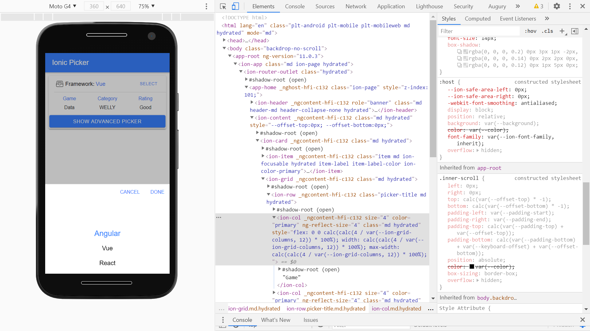
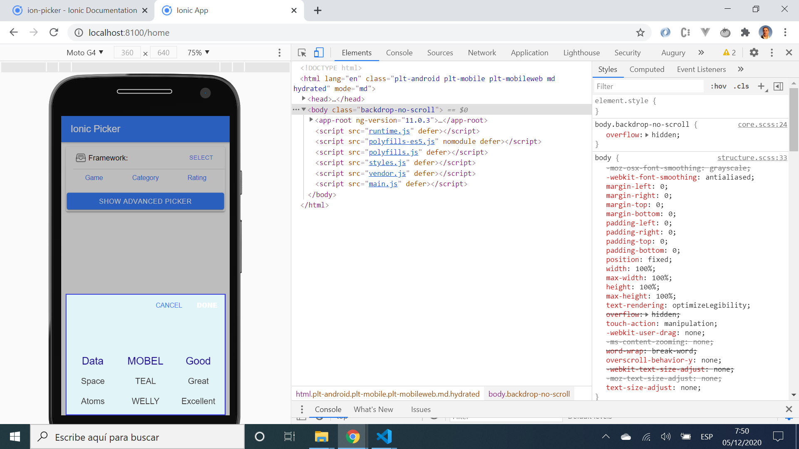

# :zap: Ionic Picker Study

* App created using the [Ionic 5 framework](https://ionicframework.com/docs) to use the [Ion-picker](https://ionicframework.com/docs/api/picker) component.
* Tutorial code from the [Ionic Academy](https://ionicacademy.com) with modifications - see [:clap: Inspiration](#clap-inspiration) below.

## :page_facing_up: Table of contents

* [:zap: Ionic Picker Study](#zap-ionic-picker-study)
  * [:page_facing_up: Table of contents](#page_facing_up-table-of-contents)
  * [:books: General info](#books-general-info)
  * [:camera: Screenshots](#camera-screenshots)
  * [:signal_strength: Technologies](#signal_strength-technologies)
  * [:floppy_disk: Setup](#floppy_disk-setup)
  * [:computer: Code Examples](#computer-code-examples)
  * [:cool: Features](#cool-features)
  * [:clipboard: Status & To-do list](#clipboard-status--to-do-list)
  * [:clap: Inspiration](#clap-inspiration)
  * [:envelope: Contact](#envelope-contact)

## :books: General info

* Extract from the [Ion-picker](https://ionicframework.com/docs/api/picker) documentation: A Picker is a dialog that displays a row of buttons and columns underneath. It appears on top of the app's content, and at the bottom of the viewport.
* No extra imported dependencies; picker controller component is part of ionic/angular, picker options component is part of ionic/core. Note: picker buttons components was not used.

## :camera: Screenshots




## :signal_strength: Technologies

* [Ionic v5](https://ionicframework.com/)
* [Angular v11](https://angular.io/)
* [Ionic/angular v5](https://www.npmjs.com/package/@ionic/angular)

## :floppy_disk: Setup

* Run `npm i` to install dependencies
* Run `ng lint` to lint files. All files pass linting.
* To start the server on _localhost://8100_ type: 'ionic serve'

## :computer: Code Examples

* extract from `picker.interface.ts` file (reached by right-clicking on '_PickerOptions_' in `home.page.ts` and choosing '_go to definition_'). Shows how to fill in Picker Column options.

```typescript
export interface PickerOptions {
    columns: PickerColumn[];
    buttons?: PickerButton[];
    cssClass?: string | string[];
    backdropDismiss?: boolean;
    animated?: boolean;
    mode?: Mode;
    keyboardClose?: boolean;
    id?: string;
    enterAnimation?: AnimationBuilder;
    leaveAnimation?: AnimationBuilder;
}
```

## :cool: Features

* single and multi-column pickers available.
* Picker css properties can be updated in `global.scss` file.

## :clipboard: Status & To-do list

* Status: Working.
* To-do: try more of the functionality from the Ion-picker component.

## :clap: Inspiration

* Project inspired by [Simon Grimm´s Youtube video: How to Present a Picker Using the Ion Picker Component](https://www.youtube.com/watch?v=bEjw--B8jS0)

## :envelope: Contact

* Repo created by [ABateman](https://www.andrewbateman.org) - you are welcome to [send me a message](https://andrewbateman.org/contact)
